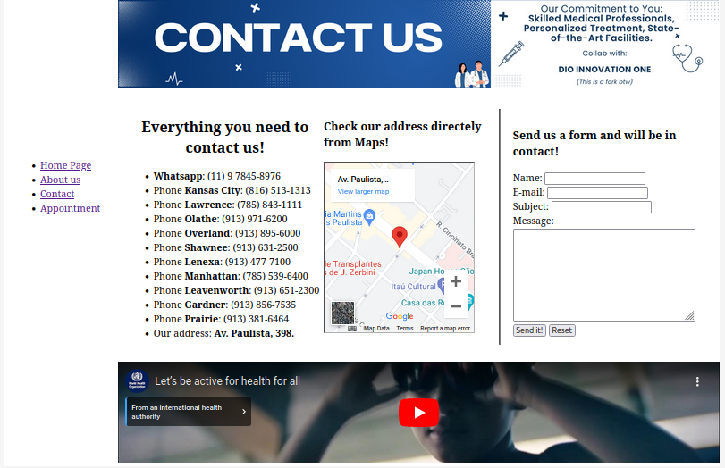

## Welcome to My 90s Style HTML Page

### Description

This project is a from the course HTML make it on **DIO Innovation One** and I call it a 1990s aesthetic because the goal of this project is not using or using the minimal CSS to recreate a look from that area, since we are learning HTML not focus on extra stylesheets.

By doing so, the project is a nostalgic throwback to the web design aesthetic of the 1990s.

### Features

- **Retro Design**: The HTML page embraces the vintage design elements popularized in the 90s, including vibrant colors, basic layouts, and animated GIFs.
- **Minimal CSS**: The CSS used in this project is kept to a minimum, staying true to the simplistic styling prevalent in 90s websites.
- **Content**: The page includes various sections reminiscent of classic web pages, such as headings, paragraphs, and a table.

### How to View

To experience the nostalgic charm of this 90s-style HTML page:

1. Clone this repository to your local machine.
2. Open the `index.html` file in your preferred web browser.
3. Sit back and enjoy a trip down memory lane as you explore the retro design elements.

### Credits

- **Professor of the course**: [Diogo Mainardes.](https://github.com/diogomainardes)
- **Forked from**: [DIO Innovation One repository](https://github.com/digitalinnovationone/trilha-html-modulo-2)
- **Inspiration**: The design and styling of this project were inspired by the web design trends of the 1990s.
